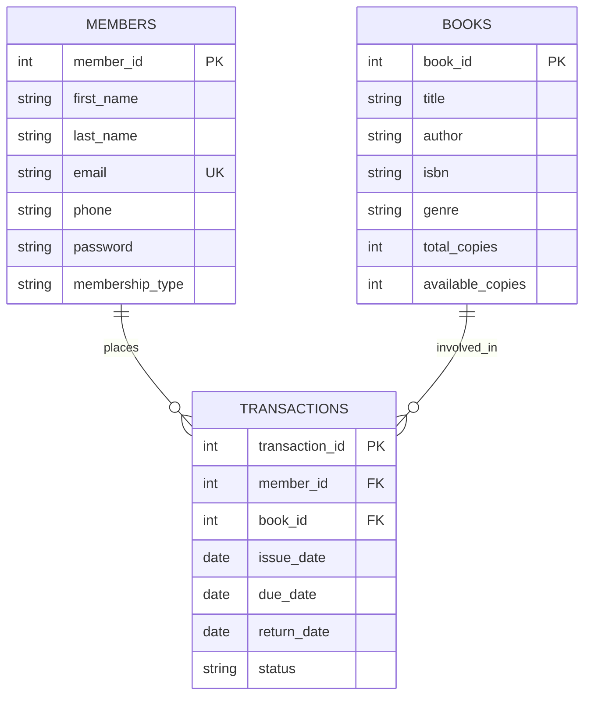
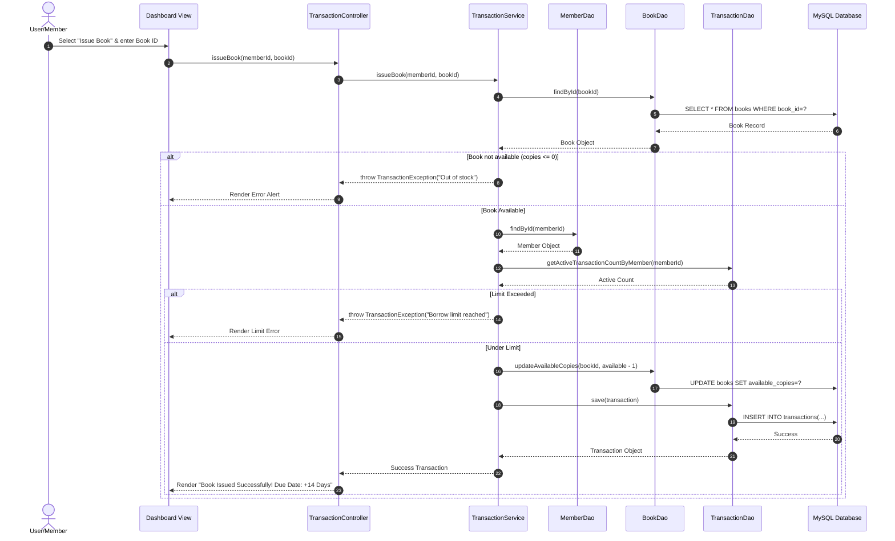

# 📚 Deep Technical Documentation & Project Explanation
## Smart Library Management System (Book Haven)

---

## 📌 Executive Summary

**Book Haven — Smart Library Management System** is an enterprise-grade, console-based Java application engineered with a strict **Model-View-Controller (MVC)** design pattern and **Data Access Object (DAO)** structural architecture. The system provides complete catalog administration, member management, automated book issuing/returning, security-conscious authentication via SHA-256 hashing, and dynamic overdue fine computation.

This document serves as an exhaustive technical guide for **academic submission**, **software architecture reviews**, **viva voce defense**, and **code walkthroughs**.

---

## 🏗️ 1. Architecture & Design Patterns

### 1.1 Architectural Pattern: Multi-Tiered MVC + DAO

The project enforces clean separation of concerns across 5 distinct architectural layers:

```
[ Console View / CLI ] ──(DTOs)──► [ Controller Layer ]
                                          │
                                       (DTOs)
                                          ▼
                                 [ Service Layer ] (Business Rules & Fine Logic)
                                          │
                                       (DTOs)
                                          ▼
                                   [ DAO Layer ] (PreparedStatements / SQL)
                                          │
                                       (JDBC)
                                          ▼
                                [ MySQL Database ]
```

| Layer | Package | Primary Responsibility | Key Classes |
|---|---|---|---|
| **View Layer** | `com.shivansh.org.view` | Interactive CLI interface, ANSI color rendering, user input capture, table formatting. | [Dashboard.java](file:///c:/ANP-D6594/WORKSPACED6594/smart_library_system/src/main/java/com/shivansh/org/view/Dashboard.java) |
| **Controller Layer** | `com.shivansh.org.controller` | Intercepts user actions from View, orchestrates calls to Service layer, catches custom exceptions, and routes responses back to View. | [BookController.java](file:///c:/ANP-D6594/WORKSPACED6594/smart_library_system/src/main/java/com/shivansh/org/controller/BookController.java)<br>[MemberController.java](file:///c:/ANP-D6594/WORKSPACED6594/smart_library_system/src/main/java/com/shivansh/org/controller/MemberController.java)<br>[TransactionController.java](file:///c:/ANP-D6594/WORKSPACED6594/smart_library_system/src/main/java/com/shivansh/org/controller/TransactionController.java) |
| **Service Layer** | `com.shivansh.org.service` | Encapsulates all domain rules, fine calculations, membership limit enforcements, email uniqueness checks, and transaction validation. | [BookServiceImpl.java](file:///c:/ANP-D6594/WORKSPACED6594/smart_library_system/src/main/java/com/shivansh/org/service/impl/BookServiceImpl.java)<br>[MemberServiceImpl.java](file:///c:/ANP-D6594/WORKSPACED6594/smart_library_system/src/main/java/com/shivansh/org/service/impl/MemberServiceImpl.java)<br>[TransactionServiceImpl.java](file:///c:/ANP-D6594/WORKSPACED6594/smart_library_system/src/main/java/com/shivansh/org/service/impl/TransactionServiceImpl.java) |
| **DAO Layer** | `com.shivansh.org.dao` | Abstraction of persistent storage. Executes parametrized SQL queries via JDBC to map ResultSet rows to DTO Java objects. | [BookDaoImpl.java](file:///c:/ANP-D6594/WORKSPACED6594/smart_library_system/src/main/java/com/shivansh/org/dao/impl/BookDaoImpl.java)<br>[MemberDaoImpl.java](file:///c:/ANP-D6594/WORKSPACED6594/smart_library_system/src/main/java/com/shivansh/org/dao/impl/MemberDaoImpl.java)<br>[TransactionDaoImpl.java](file:///c:/ANP-D6594/WORKSPACED6594/smart_library_system/src/main/java/com/shivansh/org/dao/impl/TransactionDaoImpl.java) |
| **Model / DTO** | `com.shivansh.org.dto` | Plain Old Java Objects (POJOs) representing domain entities passed between layers. | [Book.java](file:///c:/ANP-D6594/WORKSPACED6594/smart_library_system/src/main/java/com/shivansh/org/dto/Book.java)<br>[Member.java](file:///c:/ANP-D6594/WORKSPACED6594/smart_library_system/src/main/java/com/shivansh/org/dto/Member.java)<br>[Transaction.java](file:///c:/ANP-D6594/WORKSPACED6594/smart_library_system/src/main/java/com/shivansh/org/dto/Transaction.java) |
| **Security & Utilities** | `com.shivansh.org.util` | Centralized database connection lifecycle, SHA-256 cryptographic hashing, regex input validation. | [DbConnection.java](file:///c:/ANP-D6594/WORKSPACED6594/smart_library_system/src/main/java/com/shivansh/org/util/DbConnection.java)<br>[PasswordUtil.java](file:///c:/ANP-D6594/WORKSPACED6594/smart_library_system/src/main/java/com/shivansh/org/util/PasswordUtil.java)<br>[InputValidator.java](file:///c:/ANP-D6594/WORKSPACED6594/smart_library_system/src/main/java/com/shivansh/org/util/InputValidator.java) |
| **Exception Hierarchy** | `com.shivansh.org.exception` | Custom application exception hierarchy deriving from `LibraryException`. | [LibraryException.java](file:///c:/ANP-D6594/WORKSPACED6594/smart_library_system/src/main/java/com/shivansh/org/exception/LibraryException.java)<br>[BookNotFoundException.java](file:///c:/ANP-D6594/WORKSPACED6594/smart_library_system/src/main/java/com/shivansh/org/exception/BookNotFoundException.java)<br>[MemberNotFoundException.java](file:///c:/ANP-D6594/WORKSPACED6594/smart_library_system/src/main/java/com/shivansh/org/exception/MemberNotFoundException.java)<br>[TransactionException.java](file:///c:/ANP-D6594/WORKSPACED6594/smart_library_system/src/main/java/com/shivansh/org/exception/TransactionException.java)<br>[ValidationException.java](file:///c:/ANP-D6594/WORKSPACED6594/smart_library_system/src/main/java/com/shivansh/org/exception/ValidationException.java) |

---

## 🗄️ 2. Database Design & Relational Schema

### 2.1 Entity-Relationship (ER) Diagram



### 2.2 Table Specifications

#### Table 1: `books`
- **`book_id`**: `INT AUTO_INCREMENT PRIMARY KEY` — Unique book identifier.
- **`title`**: `VARCHAR(255) NOT NULL` — Book title (Indexed for fast search).
- **`author`**: `VARCHAR(255) NOT NULL` — Author name (Indexed).
- **`isbn`**: `VARCHAR(20) DEFAULT NULL` — Standard ISBN code.
- **`genre`**: `VARCHAR(100)` — Genre classification (Indexed).
- **`total_copies`**: `INT NOT NULL DEFAULT 1` — Total inventory quantity owned by library.
- **`available_copies`**: `INT NOT NULL DEFAULT 1` — Current available stock on shelf.

#### Table 2: `members`
- **`member_id`**: `INT AUTO_INCREMENT PRIMARY KEY` — Unique member identifier.
- **`first_name`**: `VARCHAR(100) NOT NULL` — First name.
- **`last_name`**: `VARCHAR(100) NOT NULL` — Last name.
- **`email`**: `VARCHAR(255) UNIQUE NOT NULL` — Member email (Indexed, used for login).
- **`phone`**: `VARCHAR(20) DEFAULT NULL` — Contact phone number.
- **`password`**: `VARCHAR(255) NOT NULL` — Hexadecimal string of 64-character SHA-256 hash.
- **`membership_type`**: `VARCHAR(50) DEFAULT 'REGULAR'` — Tier (`REGULAR`, `STUDENT`, `FACULTY`).

#### Table 3: `transactions`
- **`transaction_id`**: `INT AUTO_INCREMENT PRIMARY KEY` — Unique transaction ID.
- **`member_id`**: `INT NOT NULL (FK -> members.member_id ON DELETE CASCADE)`
- **`book_id`**: `INT NOT NULL (FK -> books.book_id ON DELETE CASCADE)`
- **`issue_date`**: `DATE NOT NULL` — Date book was borrowed.
- **`due_date`**: `DATE NOT NULL` — Mandatory return deadline.
- **`return_date`**: `DATE NULL` — Actual return date (`NULL` if still issued).
- **`status`**: `VARCHAR(50) DEFAULT 'ISSUED'` — Status (`ISSUED` or `RETURNED`).

---

## ⚡ 3. Key Business Rules & Core Algorithms

### 3.1 Security: SHA-256 Cryptographic Password Hashing

To prevent plain-text exposure, passwords are transformed into a 256-bit hash using standard SHA-256 digest:

$$\text{Hash}(P) = \text{HexEncode}(\text{SHA-256}(P))$$

Implemented in `PasswordUtil.hashPassword()`:
```java
MessageDigest digest = MessageDigest.getInstance("SHA-256");
byte[] encodedhash = digest.digest(password.getBytes(StandardCharsets.UTF_8));
StringBuilder hexString = new StringBuilder(2 * encodedhash.length);
for (byte b : encodedhash) {
  String hex = Integer.toHexString(0xff & b);
  if (hex.length() == 1) hexString.append('0');
  hexString.append(hex);
}
return hexString.toString();
```

### 3.2 Membership Tier Borrowing Limits

The system enforces tier-based active loan constraints to ensure equitable library usage:

| Membership Tier | Active Book Limit | Default Duration |
|---|---|---|
| **REGULAR** | **3 Books** | 14 Days |
| **STUDENT** | **5 Books** | 14 Days |
| **FACULTY** | **10 Books** | 14 Days |

Enforcement Logic (`TransactionServiceImpl.issueBook`):
```java
int activeCount = transactionDao.getActiveTransactionCountByMember(memberId);
int maxAllowed = getBorrowLimit(member.getMembershipType());
if (activeCount >= maxAllowed) {
  throw new TransactionException("Member has reached maximum limit of " + maxAllowed + " borrowed books.");
}
```

### 3.3 Dynamic Overdue Fine Calculation

Fine calculation is calculated on-demand at runtime without storing static fine values in the database, avoiding state desynchronization.

$$\text{Days Overdue} = \max\left(0, \text{Effective Return Date} - \text{Due Date}\right)$$

$$\text{Fine Amount} = \text{Days Overdue} \times ₹5.00$$

Where $\text{Effective Return Date}$ is:
- $\text{return\_date}$ if the book has been returned.
- $\text{LocalDate.now()}$ if the book is still currently issued (`return_date` is `null`).

Implemented in `Transaction.getCalculatedFine()`:
```java
public double getCalculatedFine() {
  if (dueDate == null) return 0.0;
  LocalDate due = dueDate.toLocalDate();
  LocalDate end = (returnDate != null) ? returnDate.toLocalDate() : LocalDate.now();
  if (end.isAfter(due)) {
    long daysOverdue = ChronoUnit.DAYS.between(due, end);
    return daysOverdue * 5.0; // ₹5 per day
  }
  return 0.0;
}
```

---

## 🔄 4. System Flowcharts & Execution Sequences

### 4.1 Book Issue Flow



---

## 🧪 5. Testing & Quality Assurance Summary

The project includes an automated **JUnit 4** test suite ([LibrarySystemTest.java](file:///c:/ANP-D6594/WORKSPACED6594/smart_library_system/src/test/java/com/shivansh/org/LibrarySystemTest.java)) covering 8 targeted areas:

```bash
mvn clean test
```

### Execution Results:
```text
[INFO] Running com.shivansh.org.LibrarySystemTest
[INFO] Tests run: 8, Failures: 0, Errors: 0, Skipped: 0, Time elapsed: 0.312 s
[INFO] BUILD SUCCESS
```

| Test Case | Method Name | Verified Behaviors | Result |
|---|---|---|---|
| **1. Security** | `testPasswordHashing` | SHA-256 deterministic output, 64-char length, null safety, digest uniqueness. | ✅ PASS |
| **2. Input Validation** | `testInputValidation` | Regex email validation, name length, password constraints, integer parsing. | ✅ PASS |
| **3. Fine Calculation** | `testFineCalculation` | On-time return, early return, late return fine calculation (3 days = ₹15), active overdue fine. | ✅ PASS |
| **4. Book DTO** | `testBookDTO` | Getters/setters, multi-constructor overloads, string representation. | ✅ PASS |
| **5. Member DTO** | `testMemberDTO` | Registration constructor, phone/email mapping, membership types. | ✅ PASS |
| **6. Transaction DTO** | `testTransactionDTO` | Issue/due date assignment, join field mappings (`bookTitle`, `memberName`). | ✅ PASS |
| **7. Edge Case Fines** | `testFineCalculationEdgeCases`| Null due date safety, exact due date return (0 fine), 1-day late (₹5), 30-day late (₹150). | ✅ PASS |
| **8. Inventory Stock** | `testBookAvailability` | Decrement on issue, increment on return, 0-stock boundaries. | ✅ PASS |

---

## ❓ 6. Viva Voce Defense & Technical Q&A Guide

Below are the **Top 15 Technical Questions** frequently asked by external examiners and interviewers, complete with architectural answers:

### Q1: Why did you choose MVC + DAO architecture instead of writing all code in one main file?
**Answer:** MVC separates presentation (View), routing (Controller), and business rules (Service), while DAO decouples SQL database queries from application logic. This ensures modularity, high cohesion, low coupling, ease of testing (unit tests don't require GUI), and code maintainability.

### Q2: How does the application prevent SQL Injection attacks?
**Answer:** The DAO layer exclusively uses JDBC `PreparedStatement` with parameterized placeholders (`?`). Values are set using methods like `pstmt.setString(1, email)`. This ensures user input is strictly treated as data parameters rather than executable SQL code.

### Q3: Why is password hashing performed with SHA-256 instead of plain text storage?
**Answer:** Plaintext password storage violates security standards. In case of a database leak or unauthorized database dump, hashed passwords cannot be reverse-engineered to reveal user passwords. We use `java.security.MessageDigest` to compute a 256-bit cryptographic digest.

### Q4: How is overdue fine computed? Is it stored in the database?
**Answer:** Fines are computed dynamically at runtime using `Transaction.getCalculatedFine()`. Storing static fines in a database leads to data staleness because fines increase every day the book remains overdue. Dynamic calculation compares `due_date` against `return_date` (or `LocalDate.now()` if unreturned) multiplied by ₹5.00/day.

### Q5: What happens if MySQL is not running when the app starts?
**Answer:** `DbConnection.getMysqlConnection()` catches `SQLException` and outputs a clear error message instructing the user to start MySQL service on `localhost:3306`. If connection succeeds, `DbConnection.initializeDatabase()` automatically builds missing tables (`CREATE TABLE IF NOT EXISTS`) and seeds initial books/members.

### Q6: What design pattern is used for exceptions?
**Answer:** A custom unchecked exception hierarchy extending `RuntimeException`. The base class is `LibraryException`, extended by domain-specific exceptions like `BookNotFoundException`, `MemberNotFoundException`, `TransactionException`, and `ValidationException`. This avoids cluttering signature declarations while allowing granular exception handling in Controllers.

### Q7: How does membership tier enforce borrowing limits?
**Answer:** In `TransactionServiceImpl.issueBook()`, before issuing a book, the system queries `transactionDao.getActiveTransactionCountByMember(memberId)`. It compares this count against the member's tier limit (`REGULAR`: 3, `STUDENT`: 5, `FACULTY`: 10). If the count reaches or exceeds the limit, a `TransactionException` is thrown.

### Q8: What database cascade actions are configured?
**Answer:** The `transactions` table defines Foreign Keys on `member_id` and `book_id` with `ON DELETE CASCADE`. If a member or book is deleted by an admin, all associated historical transaction records are automatically purged by MySQL to maintain referential integrity.

### Q9: Why use interfaces for Services and DAOs (e.g., `BookDao` interface and `BookDaoImpl`)?
**Answer:** Programming to interfaces facilitates dependency inversion and loose coupling. If we decide to swap MySQL for PostgreSQL or MongoDB in the future, we only need to create a new implementation class (e.g., `BookDaoMongoImpl`) without touching the Service or Controller layers.

### Q10: How are database connections managed?
**Answer:** JDBC resources (`Connection`, `PreparedStatement`, `ResultSet`) are managed using Java's **try-with-resources** statements. This guarantees that database connections and statements are automatically closed even if SQL exceptions occur, preventing database connection leaks.

### Q11: What regex patterns are used for validation?
**Answer:** Email validation in `InputValidator.isValidEmail()` uses RFC-compliant regex `^[A-Za-z0-9+_.-]+@(.+)$`. Name validation ensures alphabet characters with minimum length 2 (`^[a-zA-Z\\s]{2,50}$`).

### Q12: How are available copies updated when a book is issued or returned?
**Answer:** `TransactionServiceImpl` updates `available_copies` in `BookDaoImpl` within the same operation flow. On issue, `available_copies` is decremented by 1. On return, `available_copies` is incremented by 1, while preserving `total_copies`.

### Q13: What build tool and dependencies are used?
**Answer:** Apache Maven (`pom.xml`). Key dependencies include:
- `mysql-connector-j` (8.0.33) for MySQL JDBC communication.
- `junit` (4.13.2) for automated testing.
- `exec-maven-plugin` (3.1.0) for execution via `mvn exec:java`.
- `spotless-maven-plugin` (2.40.0) for automated Google Java Format code formatting.

### Q14: How does admin reporting work?
**Answer:** `TransactionController` provides `getOverdueReport()` and `getLibraryMetrics()`. `getOverdueReport()` queries active transactions where `due_date < CURDATE()`, maps joined member and book names, computes individual fines, and sums the grand total overdue fine.

### Q15: How can the project be deployed or demonstrated?
**Answer:** The project is executable directly via terminal using Maven:
1. `mvn clean compile`
2. `mvn test` (to demonstrate 100% test pass rate)
3. `mvn exec:java` (to launch interactive console UI)

---

## 🚀 7. Step-by-Step Running & Submission Instructions

### Step 1: Environment Setup
Ensure standard environment configuration:
- JDK 11+ configured (`java -version`)
- Apache Maven 3.6+ installed (`mvn -version`)
- MySQL 8.x running on `localhost:3306` (`root` / `root`)

### Step 2: Build & Verify
Run compilation and automated test suite:
```bash
cd smart_library_system
mvn clean test
```

### Step 3: Run Console Application
```bash
mvn exec:java
```

### Default Credentials
| Role | Email / Username | Password |
|---|---|---|
| **Admin** | `admin` | `123` |
| **Member (Student)** | `shivnsh01@gmail.com` | `password123` |
| **Member (Faculty)** | `jane.smith@example.com` | `password123` |

---
*Documentation compiled for Smart Library System submission.*
